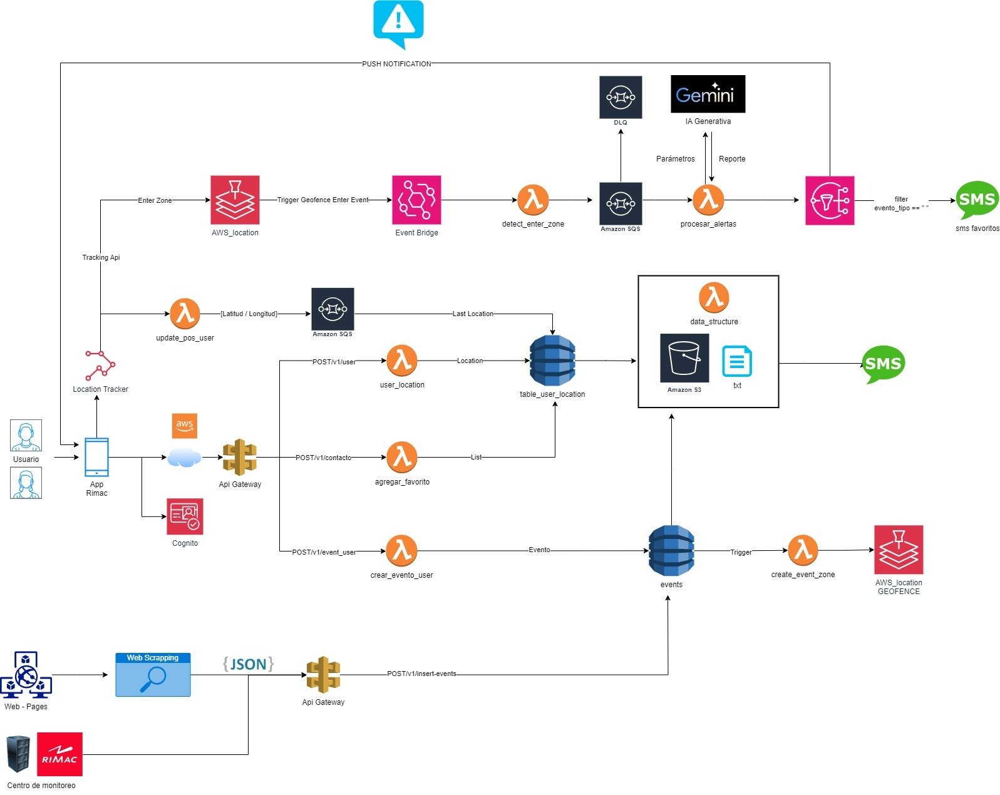

# Orrai
# hackaton_2024

| Integrantes                       | 
|-----------------------------------|
| Coorahua Peña, Ruben Aaron        |
| Golac Córdova, Luis David         |
| Arteaga Montes, Stuart Diego      |
| Surco Vergara, Maria Fernanda     |
| Mora Huamanchy, Angel Obed        |

## Descripción

Nuestra aplicación ofrece alertas sobre eventos cercanos, proporcionando información en tiempo real a los usuarios, incluso sin conexión a internet. Facilita la confirmación de la presencia de personas en la zona afectada, mejorando la respuesta ante emergencias y sirviendo como una fuente informativa valiosa.

### Carpeta `api`
Esta carpeta contiene un único endpoint que utiliza la librería `google.generativeai` para la generación de respuestas automatizadas. Este endpoint proporciona mensajes personalizados en base a las entradas recibidas. Está desarrollado en Python y emplea la API de Google para generación de texto.

### Carpeta `app_simulation_movil`

Aquí se encuentra la aplicación móvil del proyecto, desarrollada en Flutter. La aplicación proporciona una interfaz amigable para la simulación en dispositivos móviles, permitiendo a los usuarios interactuar con las funcionalidades del sistema de manera intuitiva.

### Carpeta `aws_services`

En esta carpeta se organizan los servicios de AWS que se utilizan en el proyecto. Contiene imagenes relacionado con la integración de servicios en la nube, como S3, DynamoDB, funciones Lambda, entre otros. Estos servicios son fundamentales para el funcionamiento y la gestión de los recursos del proyecto en AWS.

### Carpeta `lambas`

Esta carpeta almacena el código de las funciones Lambda desarrolladas para el proyecto. Las funciones Lambda se utilizan para ejecutar tareas específicas de manera automática, sin necesidad de administrar servidores. Aquí se encuentran los scripts y las configuraciones necesarias para el despliegue y la ejecución de estas funciones en el entorno AWS.

### Carpeta `prototype`

Almacena prototipos de vistas y diseños que seran implementadas en el proyecto. Aquí se encuentran imágenes que representan distintas vistas de la aplicación, utilizadas para el diseño y la planificación.

## Diagrama de Arquitectura 

- ****
